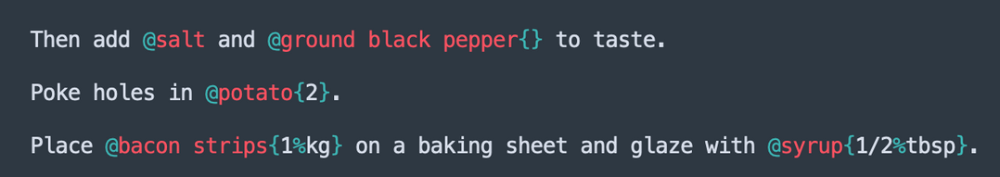

# Food & Nutrition

## Vision

## Data Sources / Inspiration

| Url                                                        | Type            | Bemerkung                                                              |
| :--------------------------------------------------------- | --------------- | :--------------------------------------------------------------------- |
| https://fdc.nal.usda.gov/download-datasets.html            | Data            | US Database frei verfügbar. Möglicherweise mit imperialen Maßeinheiten |
| https://world.openfoodfacts.org/data                       | Data            | Open Source Datensatz    7.6 GB!!!                                     |
| https://beepb00p.xyz/my-data.html                          | Program         | Idee für ein einfaches Diary System [^1]                               |
| https://fddb.info/db/de/produktgruppen/gemuese/index.html  | Data            | evtl leicht zu scrapen, aber ich weiß nicht wie vollständig und genau  |
| https://www.nutritionix.com/de/database/common-foods       | Data            |                                                                        |
| https://naehrwertdaten.ch/de/downloads/                    | Data            | Excel Tabelle mit 1100 Lebensmitteln. Sehr gut!!                       |
| https://www.bernhard-gaul.de/lebensmittel/indexnahrung.php | Data            |                                                                        |
| https://ernaehrungstagebuch-deluxe.de/kalorientabelle.html | Data            |                                                                        |
| https://cooklang.org/                                      | Markup langugae |                                                                        |
|                                                            |                 |                                                                        |


## Requirements

1. Easy tracking of daily food
2. Referencing commercial products
3. Referencing food groups if no specified product (e.g. "griechischer Salat")
4. Conversion into a diat system
5. Automatic collection of nutrition


[^1]: Example: 
    ```python
    # file: food_2017.py
    july_09 = F(
    [  # lunch
        spinach * bag,
        tuna_spring_water * can,       # can size for this tuna is 120g
        beans_broad_wt    * can * 0.5, # half can. can size for broad beans is 200g
        onion_red_tsc     * gr(115)  , # grams, explicit
        cheese_salad_tsc  * 100,       # grams, implicit as it makes sense for cheese
        lime, # 1 fruit, implicit
    ],
    [
        # dinner...
    ],
    tea_black * 10,     # cups, implicit
    wine_red * ml * 150, # ml, explicit
    )

    july_10 = ... # more logs
    ```

## Experiments

[Food log jupyter](food_log.ipynb)

## Sources for RDI

RDI = Recommended daily intake
UL = Upper intake levels

https://www.efsa.europa.eu/sites/default/files/assets/UL_Summary_tables.pdf
https://www.bfr.bund.de/cm/343/aktualisierte-hoechstmengenvorschlaege-fuer-vitamine-und-mineralstoffe-in-nahrungsergaenzungsmitteln-und-angereicherten-lebensmitteln.pdf
